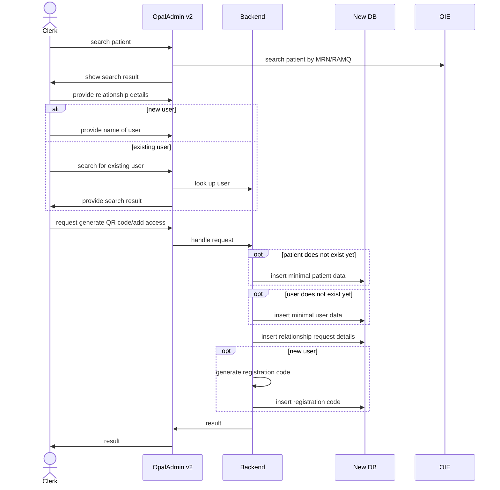
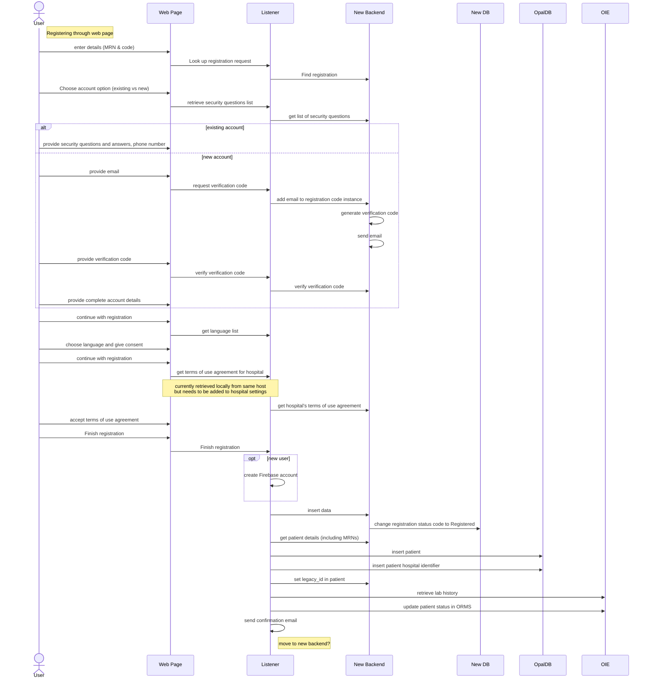

# Registration Process

## Requesting access to patient data (aka. QR Code Generation)

This reflects the currently envisioned flow with the new OpalAdmin/Backend.

## Using the registration web page

This reflects the currently envisioned flow with the new OpalAdmin/Backend via the listener's new API request functionality.

