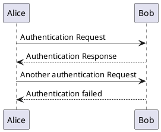

<!--
SPDX-FileCopyrightText: Copyright (C) 2023 Opal Health Informatics Group at the Research Institute of the McGill University Health Centre <john.kildea@mcgill.ca>

SPDX-License-Identifier: CC-BY-SA-4.0
-->

# Diagrams

The recommended way to create and maintain diagrams is within text, i.e., *diagrams as code*.
*Diagrams as code* is like *documentation as code* (or more generally *everything as code*) where diagrams are handled like code.
This allows us to track any diagram changes in any version control system.

In addition, this provides us the ability to review changes to diagrams before merging them (if necessary).
And, it is possible to automate their use or export into different formats.

Our main tool for creating diagrams is [PlantUML](https://plantuml.com) because there exists an extension for the [C4 model](https://c4model.com) for architecture diagrams.
Another great diagramming tool is [Mermaid](https://mermaid.js.org/).
It has a great [live editor](https://mermaid.live) and, as a distinct feature, supports Git commit graphs.

!!! tip
    [GitLab also supports both PlantUML and Mermaid](https://docs.gitlab.com/ee/user/markdown.html#diagrams-and-flowcharts).
    This means, you can augment your comments or merge request descriptions with diagrams as well to better communicate.

## Creating Diagrams

Diagrams can either be created as a standalone file or included directly within a Markdown document.
This documentation site is set up with [PlantUML Markdown](https://github.com/mikitex70/plantuml-markdown), an extension for [Python Markdown](https://python-markdown.github.io/).

The recommended file extension for standalone files is `.puml`.

To include a diagram directly within Markdown, use the following:

``````markdown

``````

<div class="result" markdown>


</div>

It is also possible to define a standalone file and include it within a page as follows:

``````markdown
```plantuml source="docs/diagrams/example.puml"
```
``````

<div class="result" markdown>
```plantuml source="docs/diagrams/example.puml"
```
</div>

The advantage of putting a diagram in its dedicated file is that the diagram is separated and can be automatically processed for other purposes.

!!! important
    The plugin requires the full path within the repository to be specified.
    For this reason the recommendation is to place all diagrams within the directory under `docs/diagrams/`.

See the [documentation of PlantUML Markdown](https://github.com/mikitex70/plantuml-markdown#introduction) for all features.

### Editors

While there is the [PlantUML online server](http://www.plantuml.com/plantuml/) with a text editor and preview, there is no autocompletion and it is separated from a development workflow using an IDE.

Fortunately, there are extensions for IDEs that provide code completion and syntax highlighting in the editor and a preview of the diagram:

* Visual Studio Code: [PlantUML VSCode extension](https://marketplace.visualstudio.com/items?itemName=jebbs.plantuml)
* IntelliJ IDEs: [PlantUML Integration](https://plugins.jetbrains.com/plugin/7017-plantuml-integration)

### PlantUML extensions

PlantUML can be extended to support additional diagrams.

A great extension is for the *C4 Model*.
See the [C4-PlantUML GitHub repository](https://github.com/plantuml-stdlib/C4-PlantUML).

## Notation Tips

The following notation tips are extracted from the talk "*Visualising software architecture with the C4 model*" by Simon Brown ([YouTube](https://www.youtube.com/watch?v=x2-rSnhpw0g&t=1219s)):

* Titles: Short and meaningful, include the diagram type, numbered if diagram order is important.
  Example: System Context diagram for Financial Risk System
* Layout
* Visual consistency: Try to be consistent with notation and element positioning across diagrams (same colour codings and shapes)
* Acronyms: Be wary of using acronyms, especially those related to the business/domain that you work in (focus more on domain-specific/business-specific acronyms)
* Elements: Start with simple boxes containing the element name, type, technology (if appropriate) and a description/responsibilities
* Lines: Favour uni-directional lines showing the most important dependencies or data flow, with an annotation to be explicit about the purpose of the line and direction
    * Summarize the intent of the relationship (SPA "makes API calls using" API application)
    * Summarize, yet be specific ("Makes API calls using" vs. "Uses")
    * Show both directions when the intents are different
    * Beware of hiding the true story: "Sends customer update messages to [via Kafka topic X]"
    * Add more words to make the intent explicit ("Sends trade data to" vs. "trade data")
* Key/Legend: Explain shapes, line styles, colours, borders, acronyms etc. (even if your notation seems obvious)
* Use shape, colour and size to **complement** a diagram that already makes sense
* Use icons to supplement text, not replace it (additional layer of information)
* Increase the readability of software architecture diagrams, so they can stand alone
* Tell stories: Any narrative (on top of the diagram) should complement the diagram rather than explain it

A checklist also
**Notation Checklist**: https://c4model.com/diagrams/checklist
