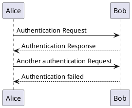
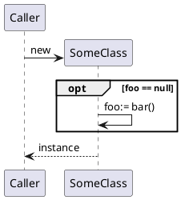

# Sequence Diagrams

Sequence diagrams are part of the [Unified Modeling Language (UML)](https://www.omg.org/spec/UML/), a standardized general-purpose graphical modeling language.

Sequence diagrams are one kind of interaction diagram which focus on the message interchange between different actors and software systems. They show the sequence of messages that are exchanged.

Sequence diagrams can be used to convey message exchanges at different levels of abstraction and to different stakeholders.

## Important Elements of Sequence Diagrams

<figure markdown>
  
  <figcaption>A sample sequence diagram with some import elements (<a href="https://mattsch.com/research/publications/#paper-7">Source</a>)</figcaption>
</figure>

A detailed overview of all the elements can be found on [uml-diagrams.org](https://www.uml-diagrams.org/sequence-diagrams.html).

## Example

Below are two examples, one showing a high-level diagram and the second one showing a more detailed diagram that is closer to code. Basically, sequence diagrams can be used to show interactions at different abstraction levels.

### High-level

Taken from the official [PlantUML Sequence Diagrams documentation](https://plantuml.com/sequence-diagram).

### Low-level

