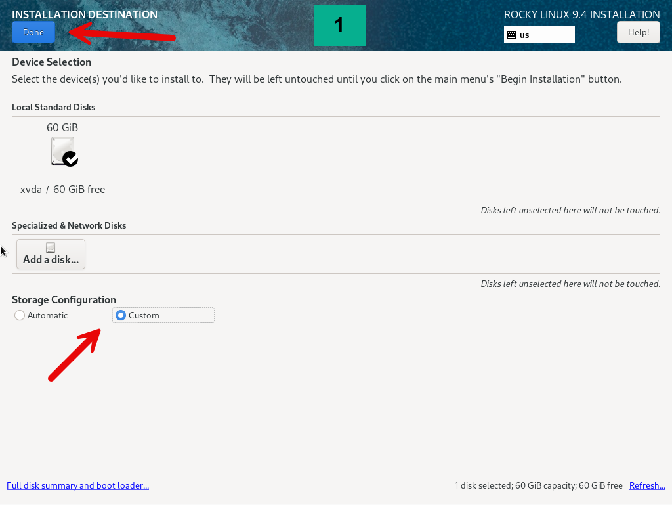
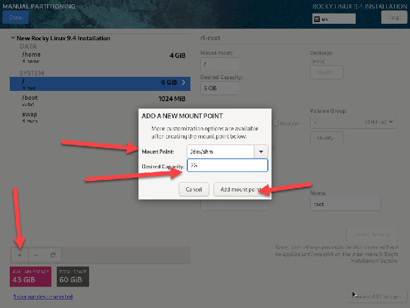
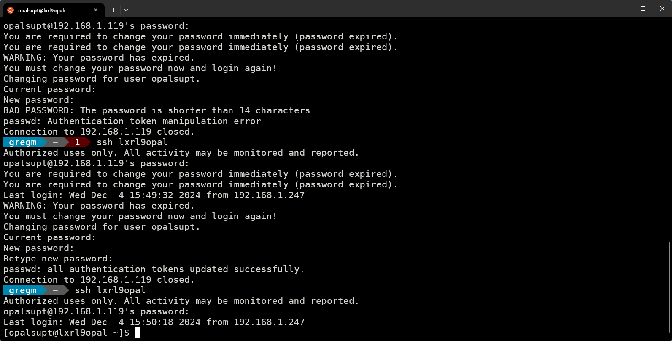

<!--
SPDX-FileCopyrightText: Copyright (C) 2025 Opal Health Informatics Group at the Research Institute of the McGill University Health Centre <john.kildea@mcgill.ca>

SPDX-License-Identifier: CC-BY-SA-4.0
-->

# Rocky Linux 9.x Install

This document will demonstrate our recommended installation for an opal server.  A single docker server can be used for small groups and expanded later for larger requirements.

We have tested and standardized on Rocky Linux 9.4, which is the successor to CentOS 7 and as such is free to use in a commercial setting while mirroring the reliability and ease of use of RedHat Linux.

To retrieve a boot ISO/CD you can download it at [Download - Rocky Linux](https://rockylinux.org/download) this will show you the latest version which at the time of this document was 9.5, if you click on archived releases you can navigate a directory structure to get to the 9.4 version used in these instructions, or just click on this link [Rocky-9.4-x86_64-boot.iso](https://dl.rockylinux.org/vault/rocky/9.4/isos/x86_64/Rocky-9.4-x86_64-boot.iso).

Once you have booted from the ISO/CD you will see this screen, you can test the media or install it immediately.

Choose your language of preference, for English either Canada or the United States is fine.

There are 6 configurations that will need attention, 7 if you choose to change the time and date on the server.  

Our default installation uses a 60G drive, with the understanding that it can be expanded for future requirement as it’s using the LVM.  Select the “Custom” option then click Done to proceed.

It’s easier to allow the installation script to automatically setup the LVM then alter it for our needs.

After the installation script configures the initial LVM setup we’ll make modifications to redistribute the space.  You can leave it as is but it will affect the hardening process as some filesystems need to have specific permissions that can’t be assigned if they aren’t created here.

By reducing the /home and / filesystems we free up storage space for the new filesystems we will create.

To create new filesystems, click the \+ button on the bottom left and a dialog box will open as follows.  The same method will apply to each of the filesystems required.

Adjust the swap to 8GB, it’s not crucial but some swap should be available to avoid Out of Memory (OOM) errors if the system approaches it’s limits.

Hit Accept Changes to apply the partitioning.

Choose a Minimal install, everything required for opal will be installed in the software document.

Choose a suitable name for the server then hit Apply then Done

The CIS Red Hat Level 1 Server profile provides sufficient protection from threats without interfering with the general functionality of opal

Create a new user such as opalsupt user for the installation of opal, be careful to make a secure note of the password you enter

Once all sections have been configured you can “Begin Installation”

After the installation is finished the Reboot System button will be available click it to restart the system.  
Determine the IP of the new server and login as the new user you created (i.e opalsupt) using SSH, it will ask you to change the initial password, keep in mind the new password must be at least 14 characters in length and consist of 4 different groups, Capital Letters, Lowercase Letters, Symbols and Numbers.

Add your new user and passwords to a password manager of your choice for safekeeping.

The first thing you will want to do is update the Rocky Linux 9.x to the latest packages.

Then reboot

Now you will want to login and create a secure SSH keypair, this will allow you to login without a password and only require one if you want to go into OS administration mode, SUDO.

The older method, RSA, has been replaced with ed25519 which is secure and fast, if you elect to use an RSA keypair then it’s best to use a 4096bit key.

As you can see in the screen capture I have copied the public key into the .ssh/authorized\_keys file.  This will allow me to take the private key saved in /home/opalsupt/.ssh/id\_ed25519 and copy it to my personal linux machine in order to SSH to the server without using a password.

Here I used SCP to copy the file from the server to my local PC, in this case using WSL on Windows which provides me a bash command prompt.

Now the server is ready for software installation.

