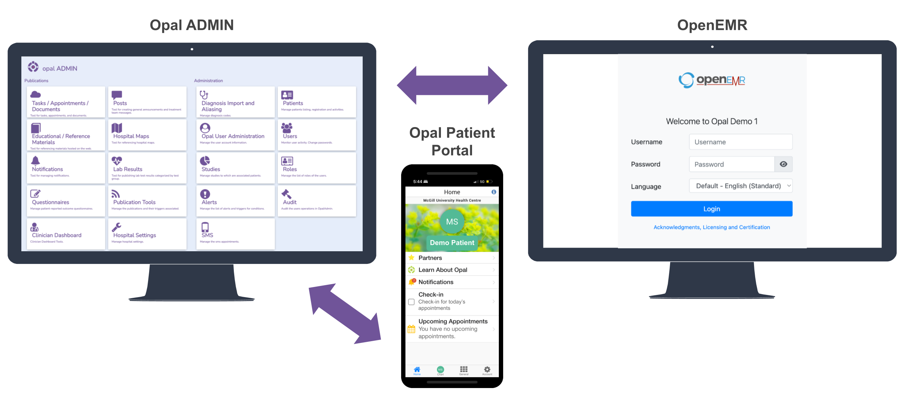

<!--
SPDX-FileCopyrightText: Copyright (C) 2025 Opal Health Informatics Group at the Research Institute of the McGill University Health Centre <john.kildea@mcgill.ca>

SPDX-License-Identifier: CC-BY-SA-4.0
-->

# User Guide

The *User Guide* is separated in two parts.

- The **Opal** section provides instructions for using our software.
    [Opal](https://www.opalmedapps.com/) is an award-winning open-source patient-in-the-loop data platform consisting of a data publishing tool (Opal ADMIN) and a patient portal (Opal app).[^1]

- Opal must be integrated with external medical systems (as the source of truth) to obtain patient data.

    [OpenEMR](https://www.open-emr.org/) is the world's most popular open-source electronic medical record system.
    The **OpenEMR** section provides instructions on how to add data in OpenEMR to then see them in Opal.
    We are continuously evolving the OpenEMR integration with more features and will add the corresponding documentation.

## Demo Environment with OpenEMR Integration

We provide a demo environment that you can use to test Opal and our integration with OpenEMR.

The following data are currently synchronized between OpenEMR and Opal[^2]:

- Diagnosis information,
- Appointment information (with maps and “how to prepare” instructions),
- Lab results (in real-time with trends and links to explanatory materials),
- Clinical notes.

The demo allows users to log in to OpenEMR, add patient data as a clinician would, and see the patient data in Opal as a patient would.
Users can create new patients, register them for Opal, and setup rules and aliases in Opal ADMIN to share data between OpenEMR and Opal.

Additionally, Opal is configured with demonstration questionnaires, education materials and treating team messages.

To use the demo, two logins are required:

1. OpenEMR
1. Opal app

Also, for certain tasks, a login to OpalAdmin is needed.

### Logins

#### OpenEMR

The demo environment provides you with a clinician who can add and modify patient data.

- **OpenEMR Demo instance:** https://openemr.opalmedapps.com
- **Username:** `DemoDoc`
- **Password:** `Painting-Spirit2-Gravel`

#### Opal App

The demo environment provides you with an Opal user **Mike Brown** who is both a patient and a *caregiver* to his wife **Kathy Brown**.

##### Mobile and Web Apps

- **iOS app:** https://apps.apple.com/ca/app/opal-patient-in-the-loop/id1446920350
- **Android app:** https://play.google.com/store/apps/details?id=com.hig.opal2
- **Web app:** https://app.opalmedapps.ca

##### User credentials

- **Username:** `mike@opalmedapps.ca`
- **Password:** `Patient.Demo1`
- **Hospital:** `Opal Demo 1 (OD1)`
- **Security Answers:**
    - What was the colour of your first car: `red`
    - What is the name of your first pet: `meg`
    - What was the name of your favorite superhero as a child: `superman`
    - What is the first name of your childhood best friend: `diana`
    - Where did you go on your first vacation: `florida`

#### OpalAdmin

The demo environment provides you with a clinician who can create education materials and questionnaires as well as aliases (for appointments, clinical notes, lab results, diagnoses).

- **URL:** https://demo.opalmedapps.com/opalAdmin/
- **Username:** `DemoAdmin`
- **Password:** `Silk7-Artificial-Floral`

### Things to try

To get a feel for how Opal and OpenEMR are integrated, we suggest trying the following tasks.

#### Add an appointment

While logged into OpenEMR as *Demo Doc*, create a **new appointment** for the patient *Mike Brown* and see it appear in *Mike Brown*'s Opal app.

1. Log in to OpenEMR as clinician *Demo Doc*
1. Create an appointment for *Mike Brown*
    - Use the category: *Consult New In*
1. Log in to the Opal app as user *Mike Brown*
1. Confirm that *Mike Brown*'s new appointment[^3] appears in the *Upcoming Appointments* on the home screen of the Opal app, or within the *Appointments* menu item in the *Chart* tab (refresh the calendar if needed with the circular arrow at the top right)

#### Add a clinical note

Add a **PDF note** to the chart of patient *Mike Brown* and see it appear in the Opal app.

1. Log in to OpenEMR as clinician *Demo Doc*
    1. Find patient *Mike Brown*
    1. Go to *Documents* for *Mike Brown*
    1. Upload a PDF document under *Mike Brown's* Medical Record
1. Log in to the Opal app as user *Mike Brown*
1. Observe the document appear in Opal in the *Clinical Reports* menu

#### Add a diagnosis

Add a **diagnosis** (medical problem) for patient *Mike Brown* and see it appear in the Opal app.

!!! note

    Only certain diagnoses are currently aliased so please follow the example below.
    If the same diagnosis is added twice for the same patient in OpenEMR, it will be shown twice in Opal.

1. Log in to OpenEMR as clinician *Demo Doc*
    1. Find patient *Mike Brown*
    1. Add a new diagnosis of **Syringomyelia and syringobulbia** using the *Medical Problems* card
1. Observe the diagnosis appear in the Opal app in the *Diagnosis* menu with today's date under the *Chart* tab

#### Send educational material

Create a simple **educational document** in Opal ADMIN, publish it to all patients with the *Syringomyelia* diagnosis, and see it appear in the Opal app for *Mike Brown*.

1. Log in to Opal ADMIN as the *DemoAdmin* user

    - Go to the *Educational / Reference Materials* menu item
    - Add a new video and use a YouTube URL
    - Remember the title you gave the material

1. Go to the *Publication Tools* menu item and add a rule for *Educational / Reference Materials*

    - Find your education material
    - Enter "Syringomyelia" in the *Diagnosis* section
    - Submit the publication
    - Find your education material again, click the “Active” checkbox and then *Save Changes*.
        This will activate the publication rule.

1. Log in to the Opal app as *Mike Brown*

    - View the video in the *Clinical Reference Material* section of *Mike Brown*'s chart

    !!! note

        It may take a few minutes for the material to get published and appear for the patient.

#### Create a new patient and request access to their data

Create a new patient in OpenEMR, request access to their data in Opal ADMIN, create a new Opal user account on Opal's registration site, and log in to the Opal app with this new user.

1. Log in to OpenEMR as *Demo Doc*
1. Create a new patient in OpenEMR
    - Be sure to complete all fields
    - Provide a 7-digit MRN (medical record number)
1. Log in to Opal ADMIN as *DemoAdmin*
    - In the Administration section, open the *Patients* menu item
    - Select *Opal Registration*
    - Search for the patient you created using their MRN
    - Follow the process until you receive the registration code and QR code
1. Either scan the QR code or go directly to the registration web site
    1. Use the MRN as the patient identification number along with the registration code
1. Follow the process until the end
1. Log in to Opal using the username, password, and security answers that you chose for the user during the registration process.

[^1]: Opal also has a fully-integrated waiting room management system but it is not yet available publicly.

[^2]: The submission of questionnaires from the Opal app to OpenEMR is a work in progress.
    Other integrated functionality will be added to this document as they become available.

[^3]: The appointment code *Consult New In* is aliased in Opal ADMIN and therefore shows as "Consultation Appointment with the medical oncologist" to the user.
