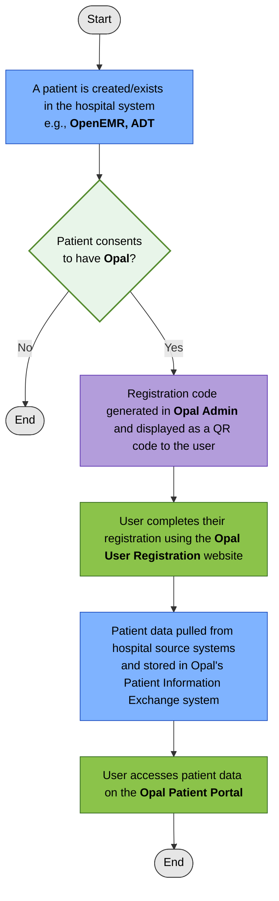
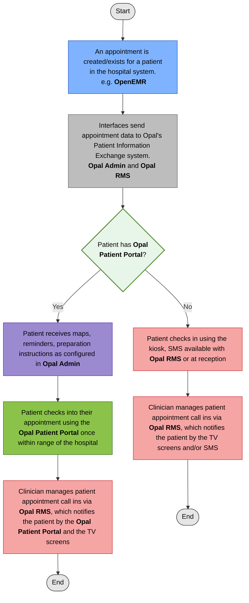

<!--
SPDX-FileCopyrightText: Copyright (C) 2026 Opal Health Informatics Group at the Research Institute of the McGill University Health Centre <john.kildea@mcgill.ca>

SPDX-License-Identifier: CC-BY-SA-4.0
-->

# The Opal Solution

The Opal solution is an open source platform created by the Opal Health Informatics Group, operating out of the Research Institute of the McGill University Health Centre in Montreal Canada. The group is directed by McGill Professor John Kildea.

The solution has four main components as seen below. The documentation will be sectioned into these components.

## Components Overview

### Opal Admin

Opal Admin is the main component for setting up and maintaining the Opal solution. It has the pages where all new system setup and configurations occur, as well as the aliasing, creating, maintaining, and publishing of content to be shared with patients and caregivers, to support the understanding of their medical data. Questionnaires can be created and published to users and the answers viewed by clinical staff in the Opal RMS component described below.

Opal Admin is also where an institution will register patients and caregivers for access to the Opal Patient Portal.

### Opal RMS

Opal RMS (aka. ORMS) stands for Opal Room Management System. This is a clinical facing component to manage clinics with a virtual waiting room. It allows for configurations by clinic and doctor to set the virtual waiting room to the desired patient list, as well as examination rooms and hardware peripherals (kiosks with room direction navigation, TV screens). Doctors may also view patient provided information, such as questionnaire responses.

The Virtual Waiting Room reflects the checked in appointments of the day, while the Clinical Viewer allows for viewing data from previous appointments.

### Opal User Registration

Once a patient or caregiver obtains a registration code from the hospital’s administrative staff, they can complete the rest of the registration on their own via the Opal User Registration website. This component is what will set up the user in Opal, and establish their password and security questions. Behind the scenes, it is at this time that the user is created in the Opal databases and data accesses will be established for any caregiver roles they have been approved for. Depending on the institution and its processes, the access might require confirmation for certain caregiver roles. It is only when this approval occurs (e.g., by the medical records department) that the user can access the patient data.

### Opal Patient Portal

The Opal Patient Portal is a mobile application designed to empower patients with their medical information. The content created by clinicians via Opal Admin, as well as data from the healthcare systems the solution has established interfaces with, will be securely provided to patients in their mobile application. The patient portal can also be accessed via a browser.

For more information about Opal, refer to the [Opal website](https://www.opalmedapps.com/).

## Components used for registering a Patient Portal user

## Components used for appointment check in

