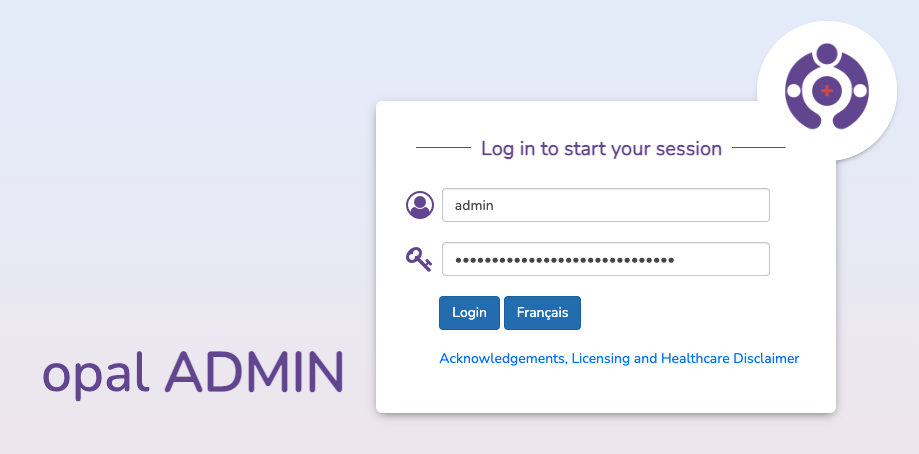
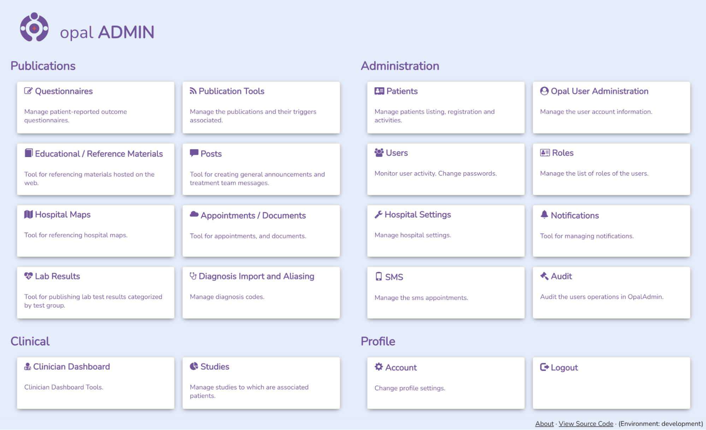
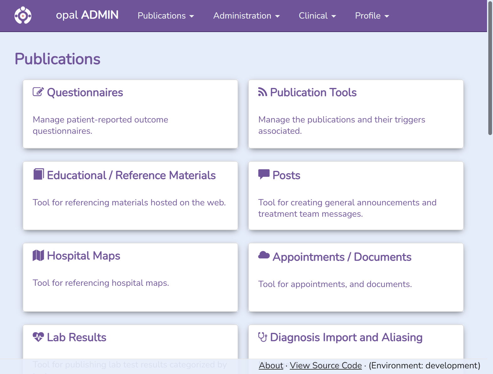
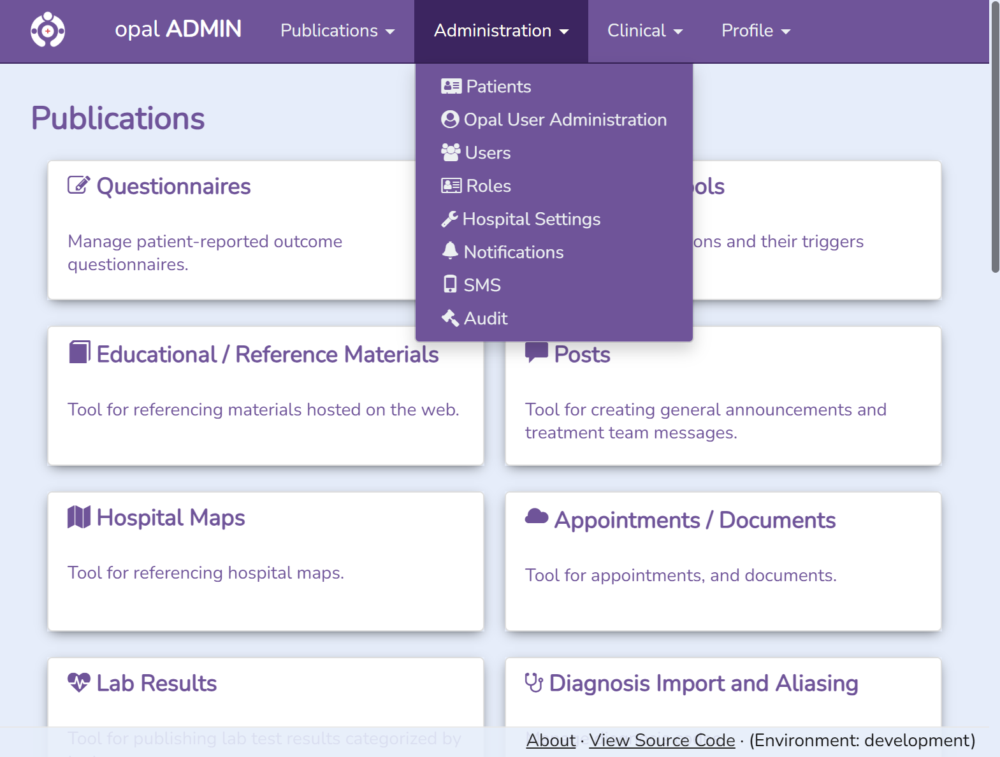
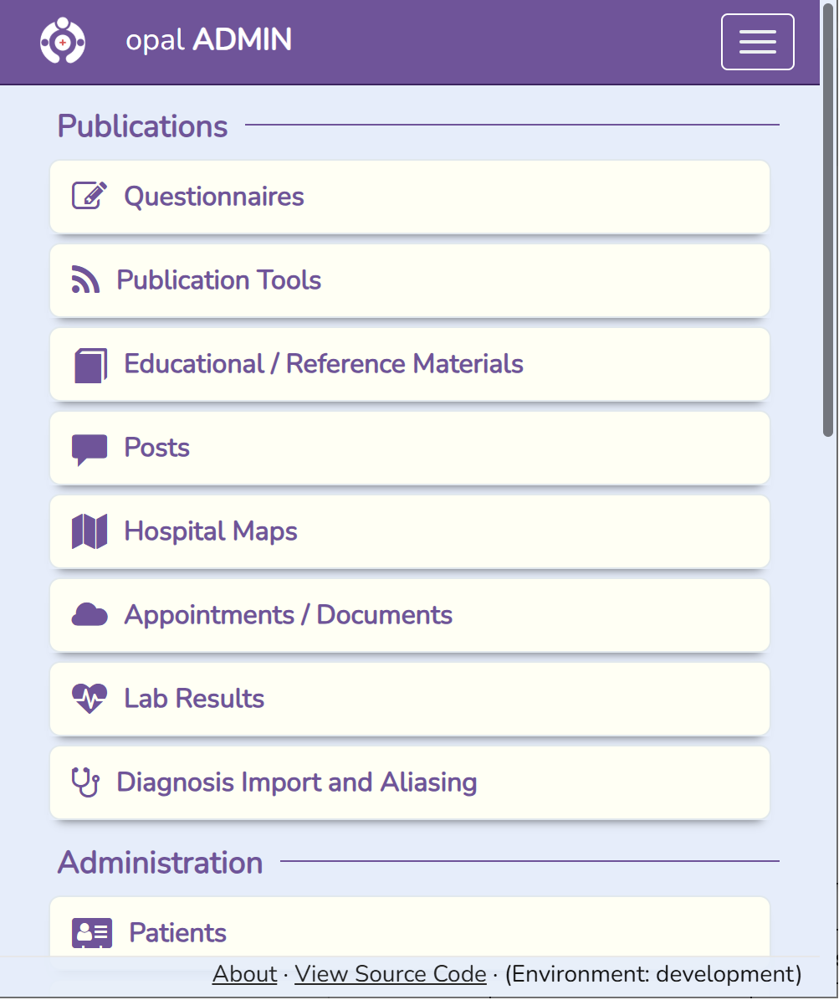
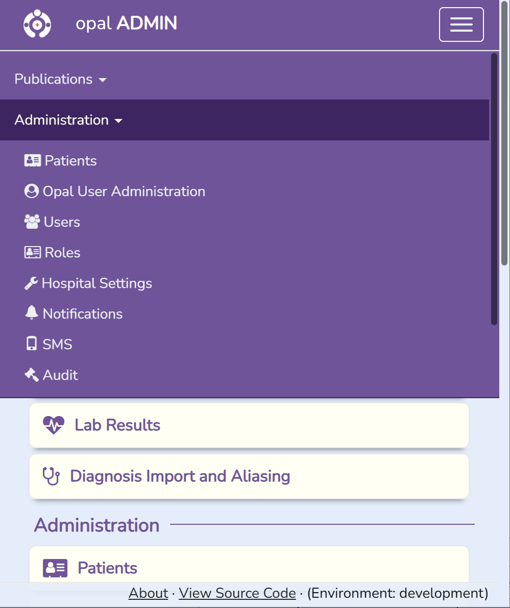
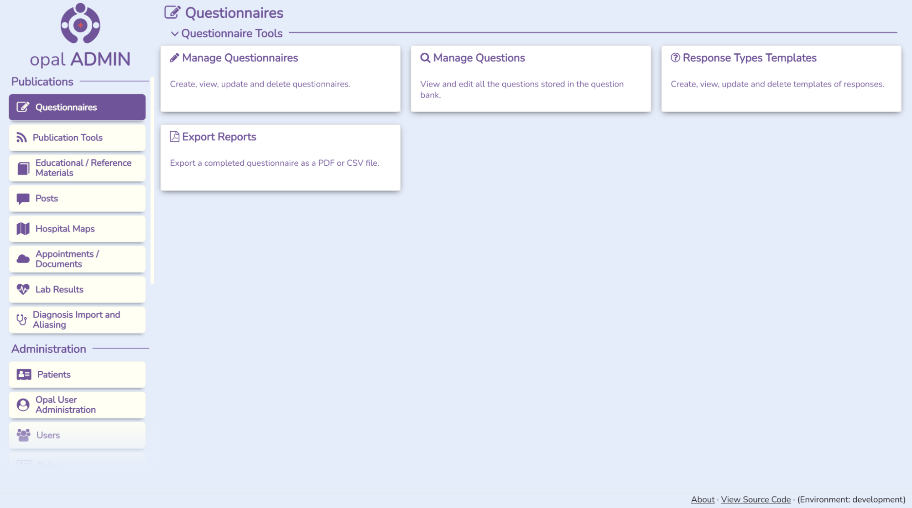
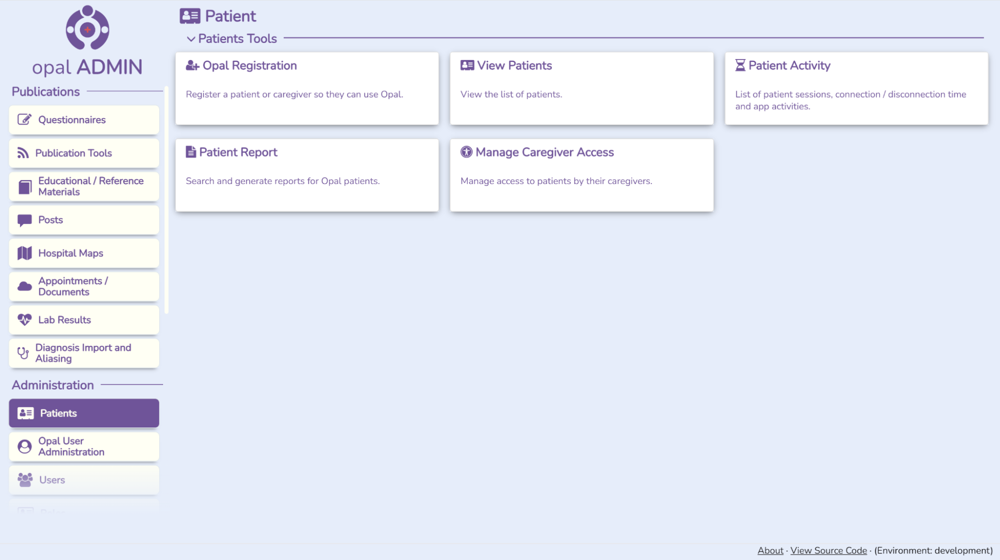
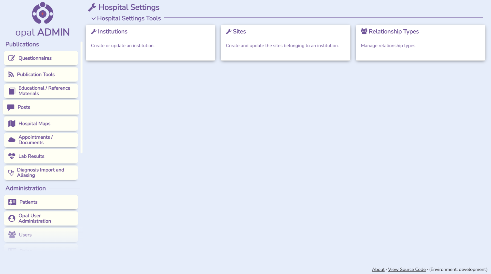
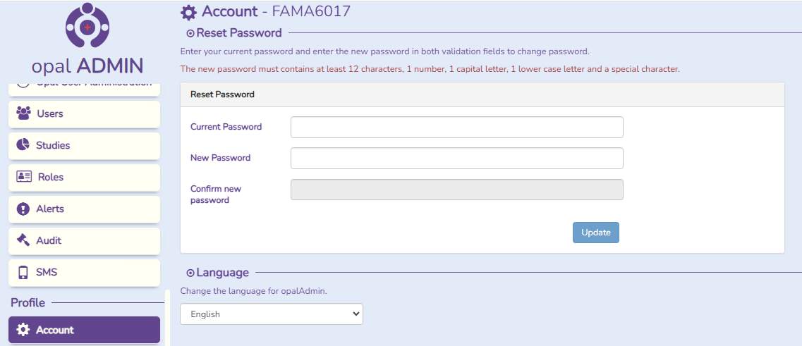

<!--
SPDX-FileCopyrightText: Copyright (C) 2026 Opal Health Informatics Group at the Research Institute of the McGill University Health Centre <john.kildea@mcgill.ca>

SPDX-License-Identifier: CC-BY-SA-4.0
-->

# Accessing and Navigating in Opal Admin

These instructions explain how to access and navigate within Opal Admin.

It is intended for any healthcare institution user who will access Opal Admin.

## User Log In

Users can access Opal Admin from their browser by entering their institution’s specific URL.
You can find the information for our demo environment on the [main user guide page](../../#opaladmin).

Some institutions may provide other access options for ease of use, not covered in this document.

After the URL has been accessed, the user will be directed to the **Opal Admin login** page, as shown below. Here they must enter their username and password. As needed, the user can click on the language button to suit their language preference. Please note that all the instructions in this document are provided in english only.

Once the personal account information has been entered, click on the **Login** button.

## Main Menu

If the user logs in while the webpage is in full screen mode, the user is directed to their Opal Admin main menu home page. What they see will depend on the roles and privileges granted to their user.

System Administrators typically have access to all of the menus and options. The full Opal Admin main menu with options listed under four sections: **Publications**, **Administration**, **Clinical** and **Profile** is displayed below.

When the webpage is not in full screen mode, the main menu will adjust as displayed in the images below. The main menu options are still listed under the four sections; **Publications**, **Administration**, **Clinical** and **Profile** via drop-down menus or the hamburger button (3 horizontal lines). No matter which page the user is in, clicking either the Opal logo or **Opal Admin** will redirect the user to the **Opal Admin** main menu page. Clicking on any of the options within a drop-down menu will direct the user to that specific page.

{width="50%"}

{width="50%"}

{width="50%"}

{width="50%"}

### Questionnaires sub-menu

### Patients sub-menu

### Hospital Settings sub-menu

## Opal Admin module overview

The **Publications** section has the following options:

- **Questionnaires**

    **Managing Questionnaires**

    Where full questionnaires are built, selecting from a list of existing questions.

    **Managing Questions**

    Where individual questions are created, selecting response types from a list of existing responses types.

    **Managing Response Templates**

    Used to create question response types.

    **Export Reports**

    Tool that allows for answered questionnaires can be exported.

- **Publication Tools**

    Where questionnaires and other content is published to the Patient Portal users using a variety of triggers.

- **Educational / Reference Materials**

    Configuration of reference materials that have been created by clinical staff to provide to the Patient Portal users.

- **Posts**

    For creation of informational posts by clinical staff, to be sent to the Patient Portal users.

- **Hospital Maps**

    Used to configure the institution’s navigation maps for use in the Patient Portal.

- **Appointments/Documents**

    Used to configure and alias appointments and documents sent to the Patient Portal users.

- **Lab Results**

    Used to configure and alias lab results, to facilitate Patient Portal User understanding.

- **Diagnosis Import and Aliasing**

    Used to configure and alias diagnosis codes, to facilitate Patient Portal User understanding.

The **Administration** section has the following options:

- **Patients**

    **Opal Registration**

    This is where hospital staff can generate a registration code for an Opal Patient Portal User.

    **View Patients**

    View the list of patients that have been registered to use the Patient Portal.

    **Patient Activity**

    View the patients who have accessed their Opal Patient Portal.

    **Patient Report**

    Shows the information gathered in the Opal solution for the patients.

    **Manage Caregiver Access**

    This is an administrative tool that is used to provide access to patient data by authorized caregivers.

- **Opal User Administration**

    This tool allows administrators of the Opal Solution to assist the Patient Portal users with changes to their user accounts.

- **Users**

    Where Opal Admin users are created and maintained.

- **Roles**

    Where roles are created and maintained, defining access privileges.

- **Hospital Settings**

    **Institution**

    Where you set the default configurations used by the institution.

    **Sites**

    Where you set GPS coordinates, addresses, direction & parking information for the various sites within your institution.

    **Relationship Types**

    Establishes caregiver types to be used by the system. Establishes legal age of autonomy, and other behavioral configurations.

- **Notifications**

    Allows for customization of notifications used by the system.

- **SMS**

    Tool to manage appointment codes that can send SMS messages.

- **Audit**

    Audit Information on Opal Admin use activity.

The **Clinical** section has the following options:

- **Clinician Dashboard**

    **Opal Room Management System**

    This is where clinicians can access their Virtual Waiting Rooms for managing patient flow in their clinics. They can also access other clinical view options, such as the displays on the TV screens, or the Clinical Viewer that allows to view past appointment information.

- **Studies**

    This is where users can create studies, assigning patients, consent forms, questionnaires, etc.

The **Profile** section has the following options:

- **Account**

    Used for changing your password and language preferences

- **Logout**

    Log out of Opal Admin

## Profile Section

Under the **Profile** section of Opal Admin there are two options, **Account** and **Logout**.

### Account

The **Account** option allows the user to change their Password and their Language settings.

The user will be directed to the **Account** page by either clicking on the **Account** button from the list of modules on the left-hand side of the page, or by clicking on the **Account** button under the **Profile** section of the main menu page. The user can see their **username** to the right of the **Account** page title and there are options for **Reset Password** and **Language.**

To reset the Opal Admin password, the user must enter the **current password**, enter the **new password**, **confirm the new password** and click on the **Update** button. To change the Opal Admin language, the user must select from a drop-down menu.

### Logout

The Logout button allows the user to log out of Opal Admin. Opal Admin is also configured with an idle timeout to ensure work stations are not left logged in when unattended.
