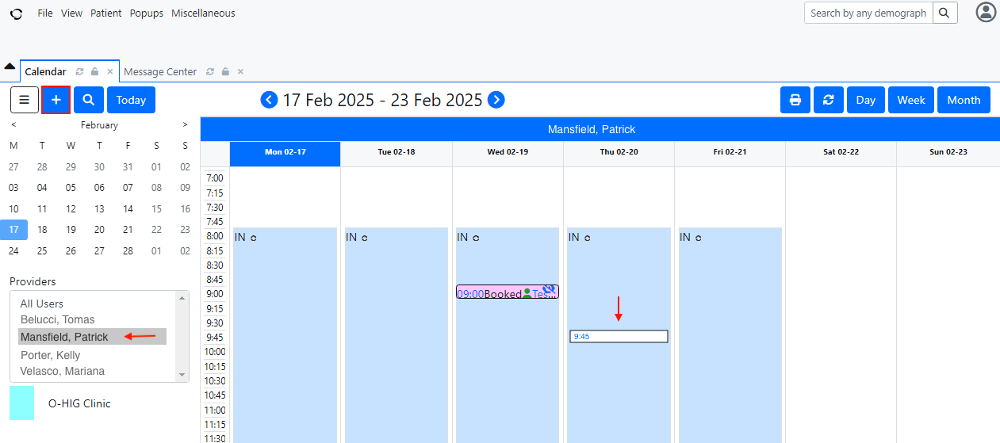
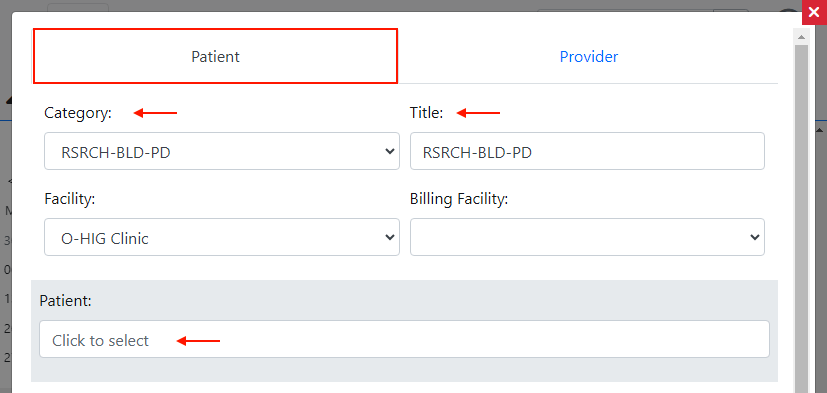
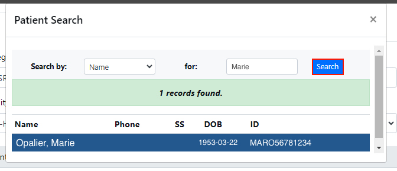
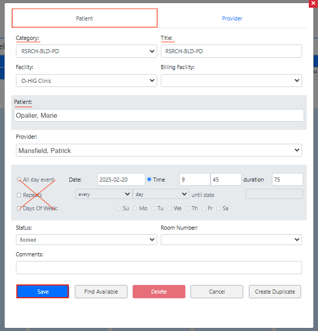
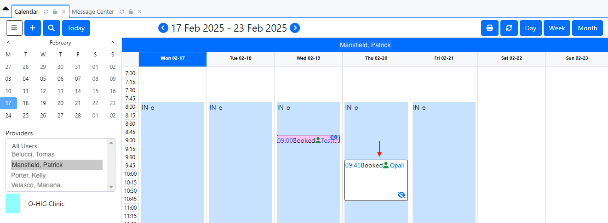
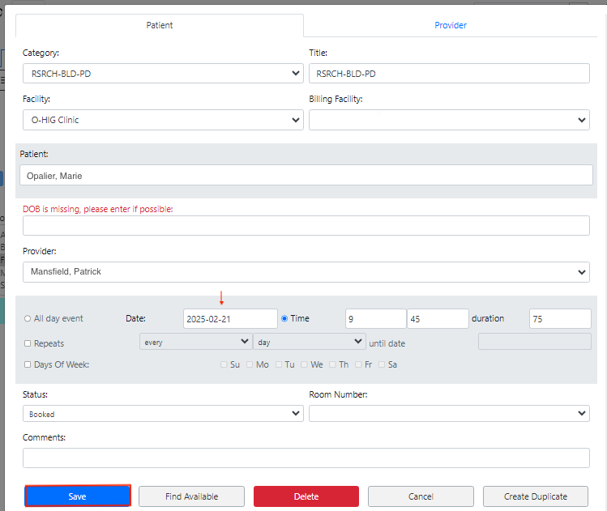

<!--
SPDX-FileCopyrightText: Copyright (C) 2026 Opal Health Informatics Group at the Research Institute of the McGill University Health Centre <john.kildea@mcgill.ca>

SPDX-License-Identifier: CC-BY-SA-4.0
-->

# Scheduling appointments in OpenEMR

This document does not provide full OpenEMR instructions for creating and updating appointments. It is intended for clinics or health systems integrating with the Opal application, with the minimal OpenEMR requirements for this integration.

If you need more information about OpenEMR and its complete set of features, please refer to this link: [https://www.open-emr.org/](https://www.open-emr.org/)

The purpose of this document is to show the steps for scheduling an appointment in OpenEMR. This document is intended for the hospital’s scheduling staff.

## Creating an appointment

1. Access OpenEMR and login.

1. A **Calendar** section will appear. A list of available **Providers** will be located on the left of the screen. By clicking on a name from the list, you will see the provider's calendar and their availability for scheduling an appointment.

1. Click on **the date and time** when the appointment should be scheduled. You can also do this using the “**+**” button located at the top left of the screen.

    

1. A pop-up window will appear. On the **Patient** tab, select a **Category** for the appointment. The **Title** will automatically appear according to the appointment code selected in the Category field. Click on the **Patient** field.

    

1. A **Patient Search** pop-up window will be displayed. Search for the patient for whom you want to schedule an appointment. You can search by Name, DOB or ID. When you have found the patient or the candidate, click on the **Search** button. The patients name should now appear in the appropriate field.

    

1. Ensure the providers name appears in the **Provider** field. If it does not, select the provider from the drop down. Now, select an **appointment date** and, if necessary, also enter the **appointment time** and **duration**. Note: Do not click on the following checkboxes: All day event; Repeats and Days of Week, in the demo environment.

1. After verifying that all the information is correct, click on the **Save** button on the bottom of the screen. The scheduled appointment will now appear in the provider’s calendar.

    

    

## Updating an appointment

1. In the **Calendar** section, double click on the appointment you want to update.

    

1. A pop-up window will appear with all the appointment information on the **Patient** tab. Once the appointment information is updated, click on the **Save** button at the bottom of the screen.

    

1. The appointment will appear in the calendar with the updated information. In this example, the appointment date was updated.

    
