<!--
SPDX-FileCopyrightText: Copyright (C) 2025 Opal Health Informatics Group at the Research Institute of the McGill University Health Centre <john.kildea@mcgill.ca>

SPDX-License-Identifier: CC-BY-SA-4.0
-->

# OpenEMR: Adding a diagnosis to a patient

This document does not provide full OpenEMR instructions for creating and adding a diagnosis to a patient. It is intended for clinics or health systems integrating with the Opal application, with the minimal OpenEMR requirements for this integration.

If you need more information about the OpenEMR system and its complete set of features, please refer to this link: [https://www.open-emr.org/](https://www.open-emr.org/)

The purpose of this document is to show the steps for adding a diagnosis to the OpenEMR system, with the objective of assigning it to a patient, so that they or their caregiver can view it in their Opal account. This document is intended for the Hospital's administrator staff.

## Adding a diagnosis in OpenEMR

1. To access OpenEMR - Opal Application, go to the **OpenEMR** website (Refer to [https://www.opalmedapps.com/](https://www.opalmedapps.com/) ).

1. A **Calendar** section will appear. A list of **Providers** will be located on the left of the screen. By clicking on a specific name of the list, you can see the provider's calendar and their scheduled appointments.

1. At the top of the screen, click on the **Admin** section. A drop-down menu will be displayed. Click on the **Forms** tab, and then click on **Lists**.

    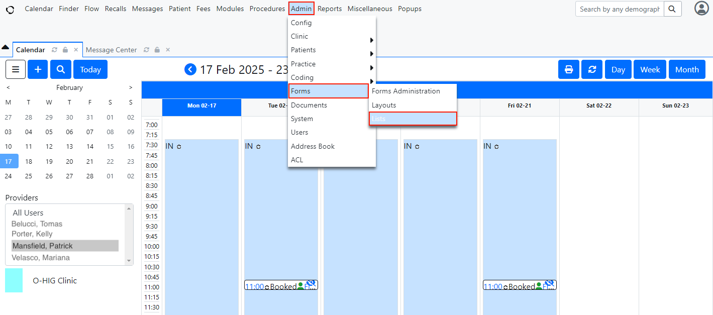

1. A **List Editor** section will be displayed. Click on the drop-down menu (where you read “Address Book Types”) and select the **Medical Problem List** option.

    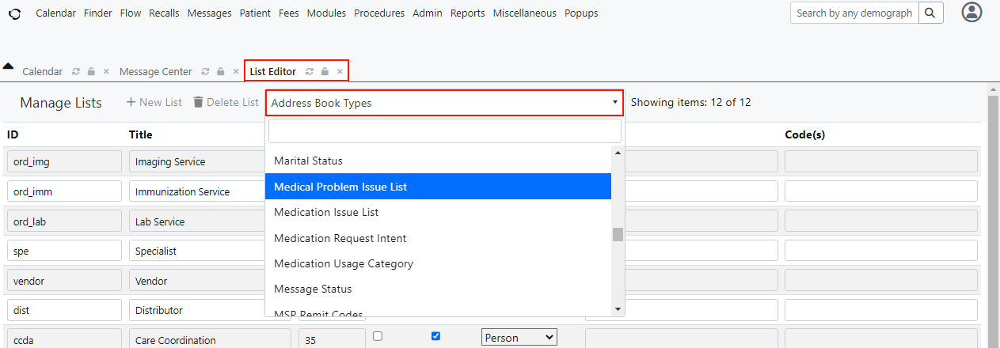

1. A list of previously added diagnosis codes will be displayed, showing their titles, their IDs and other information, like the example of Parkinson disease diagnosis codes shown in the figure below. Click on a blank **Code** field.

    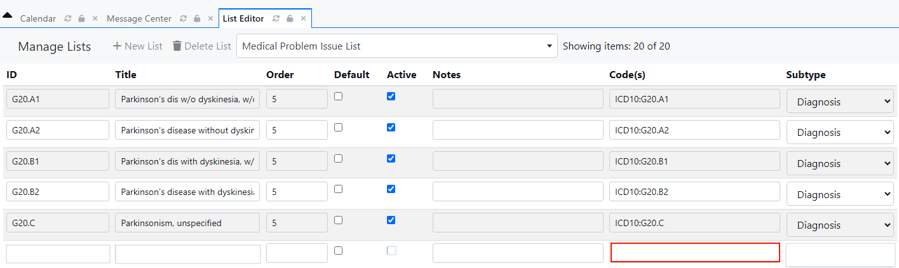

1. A pop-up window will appear and a drop-down menu will be located at the top left of the screen. Click on the drop-down menu and select the **ICD10 Diagnosis**.

    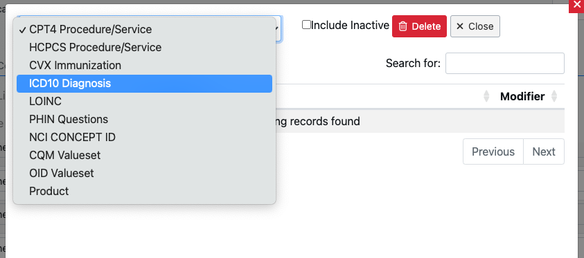

1. You must search for the diagnosis/code that will be added to the patient's Medical Record. In the figure below, the diagnosis to be added is *Tuberculosis of lung*. You can also search for a diagnosis on the **Search** field at the top right of the screen.

    

1. Once the diagnosis has been found from the **ICD 10 Diagnosis list**, you should copy its **Code** and **Description** and paste them at an empty **ID** and **Title** fields, respectively, located at the **List Editor** section. After pressing the enter button of your computer, the complete diagnosis code will appear automatically at the **Code** field at the same section. These three fields, **ID**, **Title** and **Code** are mandatory fields and must be completed.

1. You must select the **Active** checkbox for the patient's diagnosis to appear in the Opal application. At the optional **Subtype** field (optional), you can choose **Diagnosis** from the drop-down menu.

    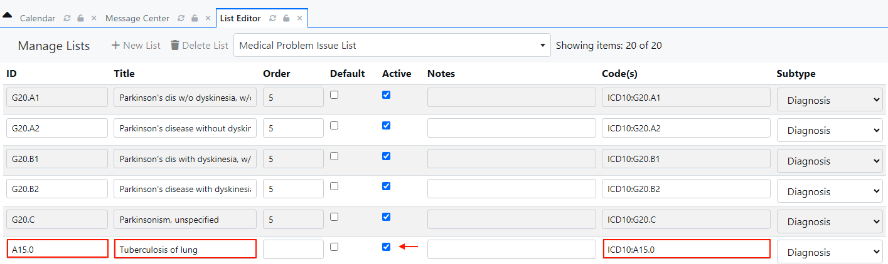

1. The order of the diagnosis can be chosen according to your preference, by adding the proper number in the **Order** field, like shown in the figure below.

    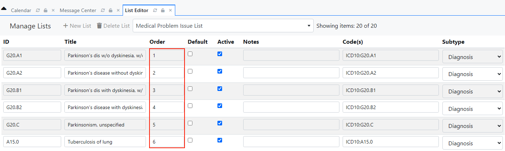

## Assigning a diagnosis to a patient in OpenEMR

1. Once in the OpenEMR system, a **Calendar** section will appear. At the top of the screen, click on the **Patient** button. A list will appear with three options: **New/Search, Visits** and **Records**. Click on the **New/Search** tab.

    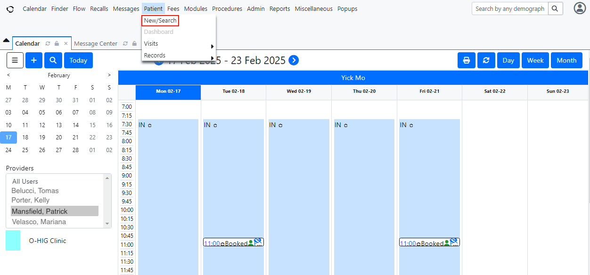

1. The **Search or Add Patient** section will be displayed. You can search for the patient, to whom you want to assign the diagnosis, in two ways: by typing in the patient's personal information, such as **Name, Last Name, RAMQ** or Medical Record Number (**MRN**) then clicking on the **Search** button; or by clicking directly on the **Search** button, where a list of all patients with their information will appear, and you must search the specific patient.

    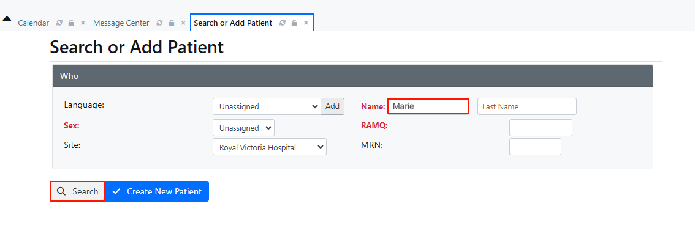

    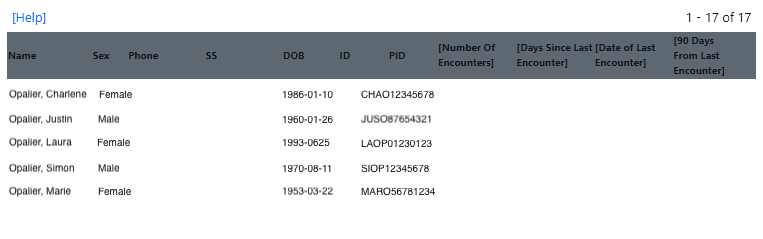

1. Once you have found the patient's name, double click on it. The patient's **Medical Record Dashboard** will be displayed, showing several health information sections as default. At the **Medical Problems** section, click on the **pencil** button located on the top right side of the section.

    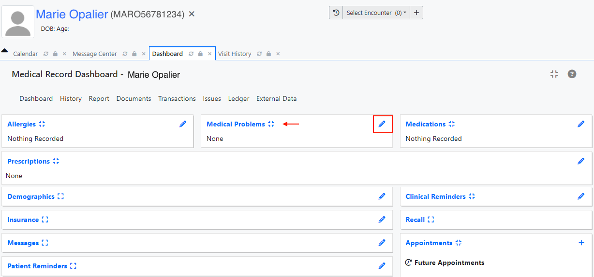

1. A **Patient Issues** tab will be displayed. The patient already may or may not have a previous diagnosis on their list of Medical Problems. At the right side of this section, click on the **Add** button.

    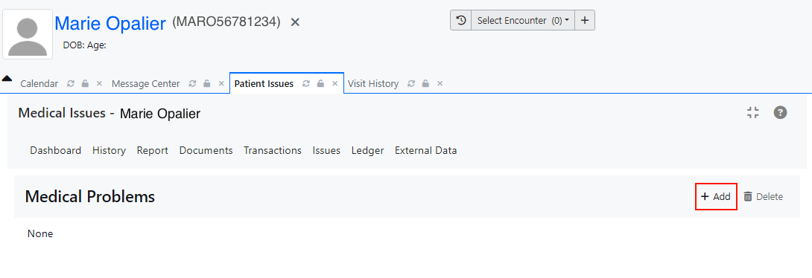

1. An **Add/Edit** Issue window will pop-up and you can search for the name of the diagnosis codes by clicking on the drop-down menu and selecting it from the list, or by entering the diagnosis name in the **Title** field.

    After adding the diagnosis name, click on the blue **Save** button.

    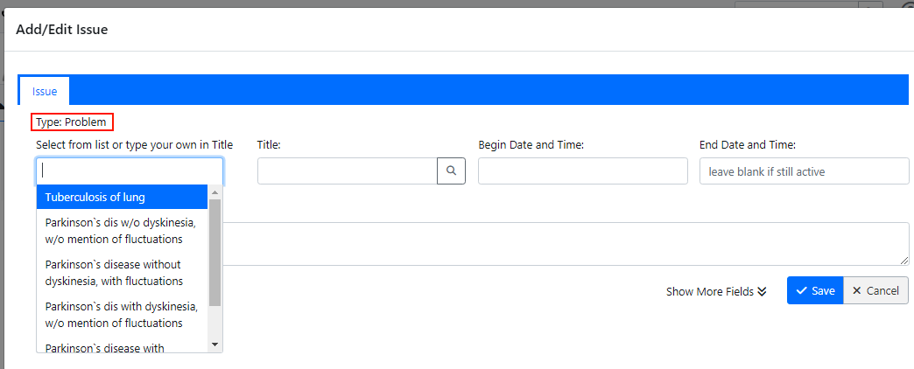

    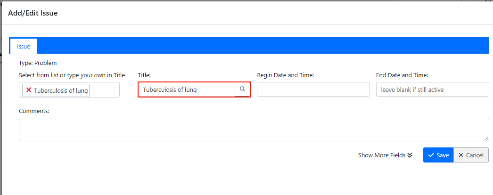

1. On the **Patient Issues** tab, the diagnosis just assigned to the patient will appear. If you expand the information by clicking on the down arrow shown in the figure below, you can see the date of when the diagnosis was last modified and also the diagnosis code.

    

1. By clicking on the patient's name at the top left of the screen, a **Dashboard** tab will be displayed. You will see the patient's **Medical Record Dashboard** and, in the **Medical Problems** section, the diagnosis that has just been assigned to the patient will be written.

    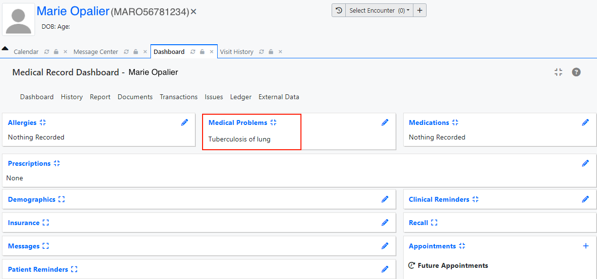

1. Only after assigning a diagnosis to a patient in the OpenEMR system, its diagnosis code will appear in the Opal Admin system. In this system, the diagnosis code will need to be aliased, so that the patient or caregiver can see the diagnosis in their Opal account.

1. After logging into their Opal account, the patient or caregiver is able to view the new diagnosis by clicking on the Diagnosis tab at the Chart section.

{ width=250 }
