<!--
SPDX-FileCopyrightText: Copyright (C) 2025 Opal Health Informatics Group at the Research Institute of the McGill University Health Centre <john.kildea@mcgill.ca>

SPDX-License-Identifier: CC-BY-SA-4.0
-->

# OpenEMR: Adding a document

This document does not provide full OpenEMR instructions for creating documents. It is intended for clinics or health systems integrating with the Opal application, with the minimal OpenEMR requirements for this integration.

If you need more information about the OpenEMR system and its complete set of features, please refer to this link: [https://www.open-emr.org/](https://www.open-emr.org/)

The purpose of this document is to show the steps for adding a new document, for example a clinical note, to the OpenEMR system, with the objective of a patient or their caregiver being able to view it in their Opal account. This document is intended for the Hospital front desk staff.

1. To access OpenEMR - Opal Application, go to the **OpenEMR** website (Refer to [https://www.opalmedapps.com/](https://www.opalmedapps.com/) ).

1. A **Calendar** section will appear. A list of **Providers** will be located on the left of the screen. By clicking on a specific name of the list, you can see the provider's calendar and their scheduled appointments.

1. At the top left of the screen, click on the **Patient** section. A list will appear with two options: **Find Patient** and **Add Patient**. Click on the **Find Patient** tab.

    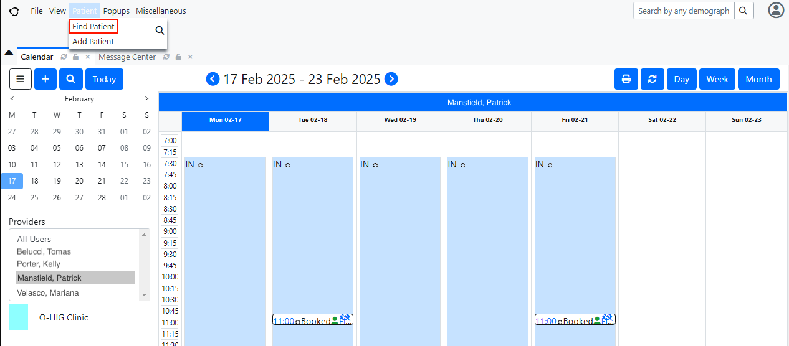

1. The **Patient finder** section will be displayed. You will see a list of patients added to the system and some of their personal information, such as the Home Phone and the Date of Birth. Select a patient to whom you want to add the document to the file and double click on the name.

    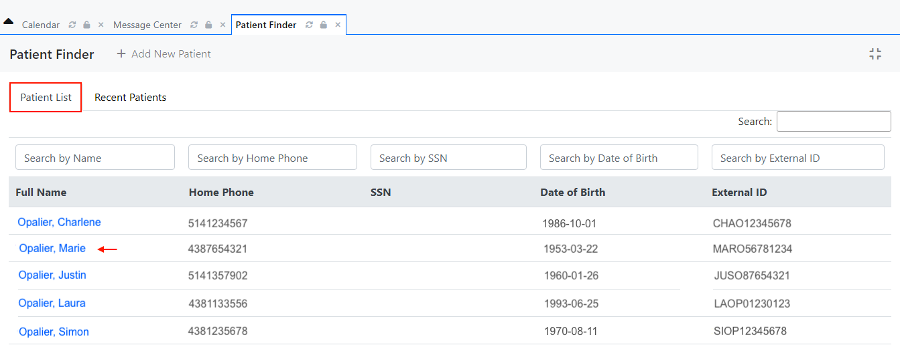

1. The patient's **Medical Record Dashboard** will be displayed, showing their Demographics information as default. Click on **Documents** located above the Demographics section.

    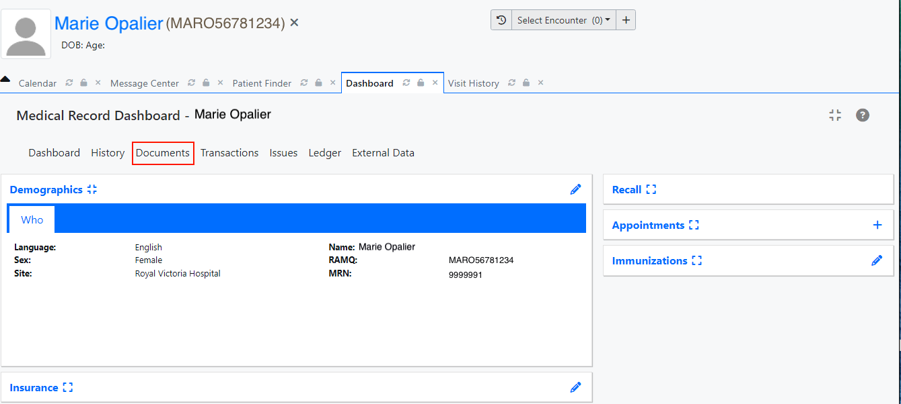

1. A **Documents** tab will be displayed and you can see a Documents List on the left side of the screen. To be able to add a document to the patient's profile, you must click on the **Medical Record** category in the list.

1. The **Document Uploader/Viewer section** will show the options to upload the document that will be added to the patient's Medical Record Dashboard. Click on the **Choose Files** button located under **Source File Path**.

    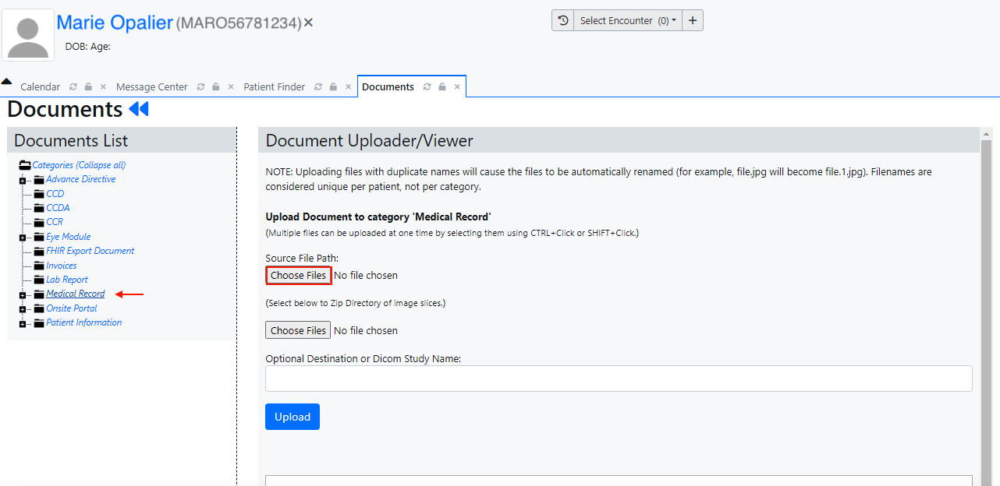

1. A window will pop-up, showing the path to where the document is located. After selecting the document that will be added to the system, click on the blue **Upload** button.

    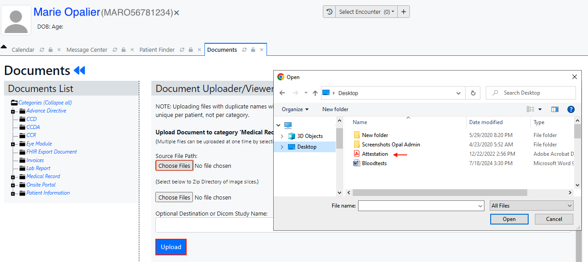

1. You must verify and confirm that the correct document was uploaded, by checking if the PDF file's name is showing on the right side of the **Choose Files** button and also under the word **Uploaded** at the bottom of the screen.

    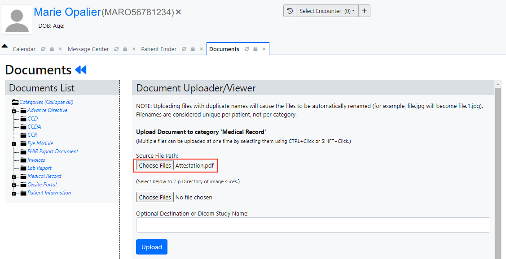

    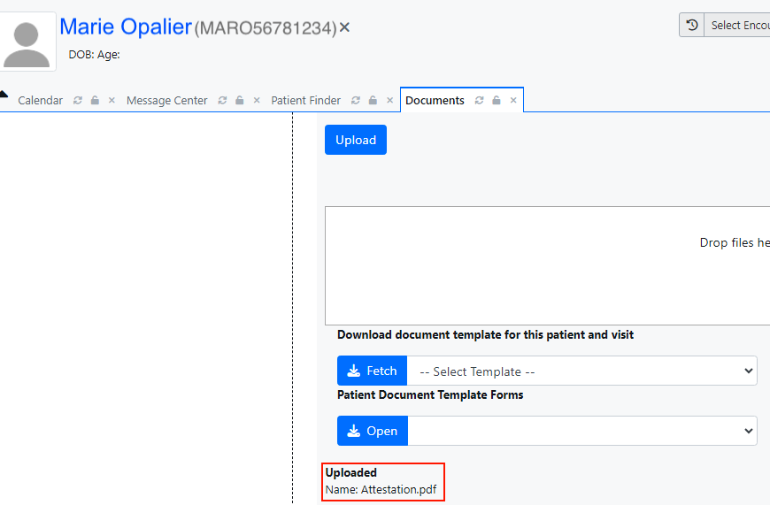

1. Once the document has been uploaded, the patient will receive a "**New Document**” push notification on their mobile device.

    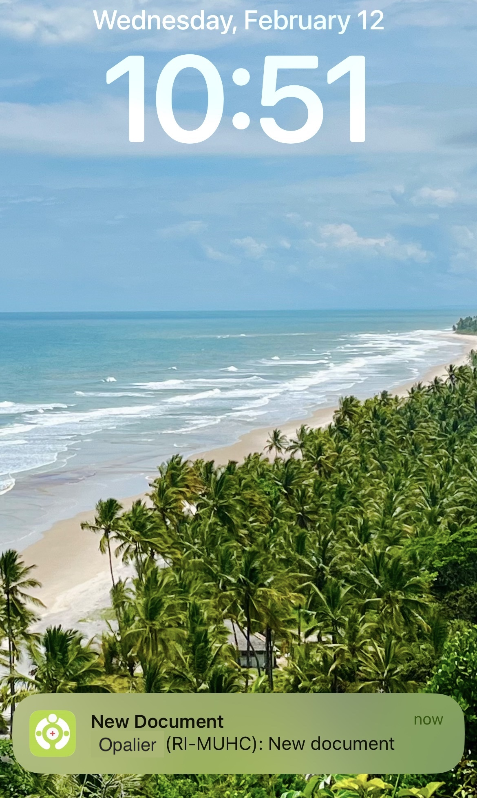{ width="250"}

1. After logging into their Opal account, the patient is able to view the new document in two ways: by accessing the **Notification** page at the **Home** section and clicking on the **New Document** received or by accessing the **Clinical Reports** page at the **Chart**section and clicking on the new document "Medical Record” received.

    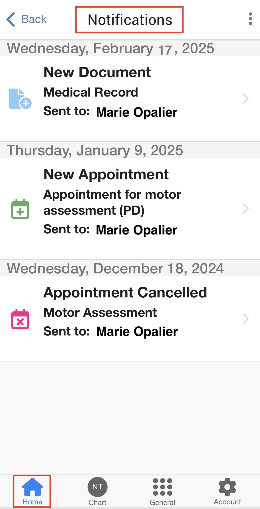{ width="250" }

    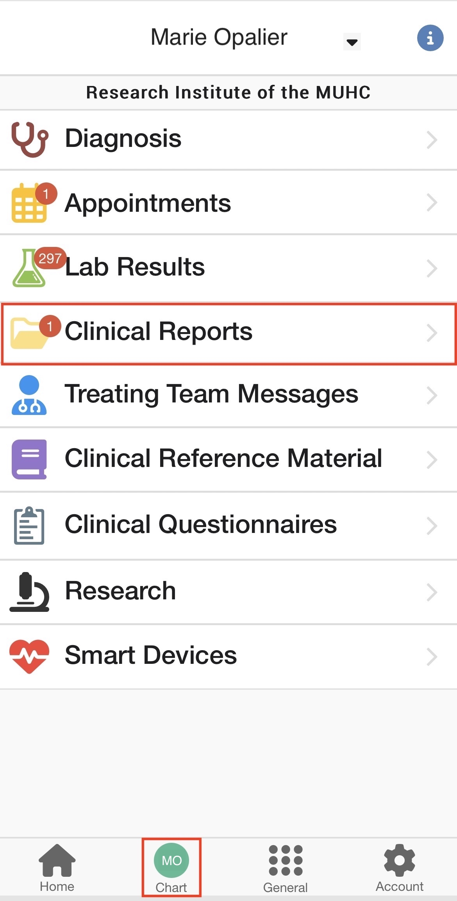{ width="250" }

    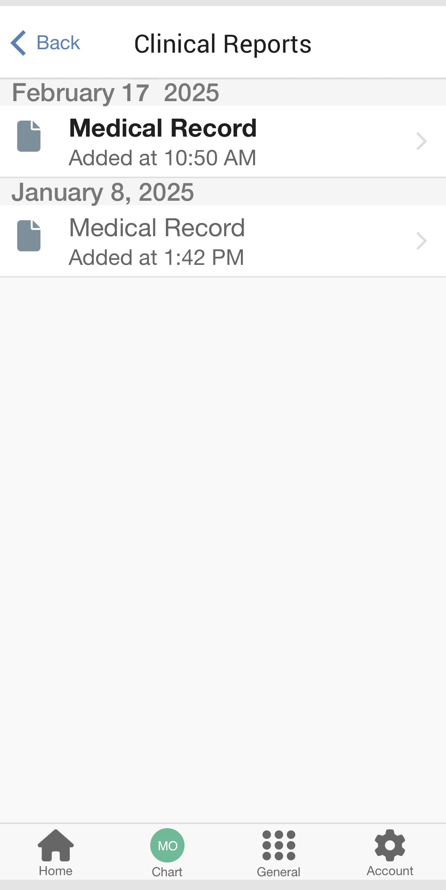{ width="250" }
