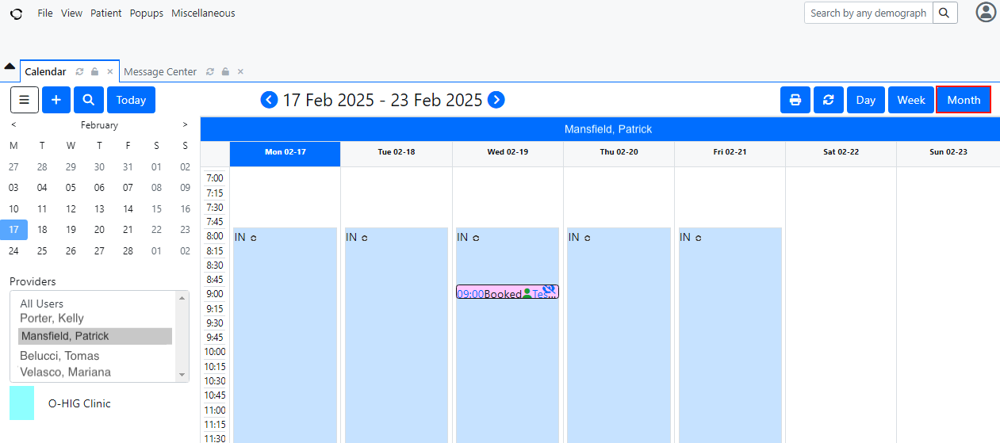
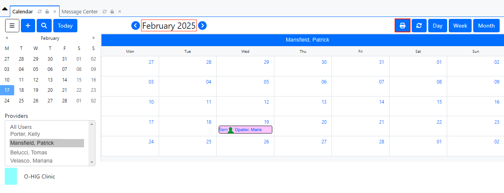
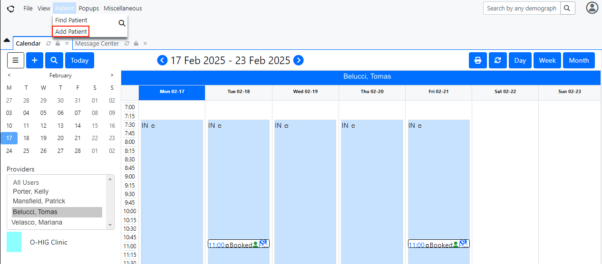
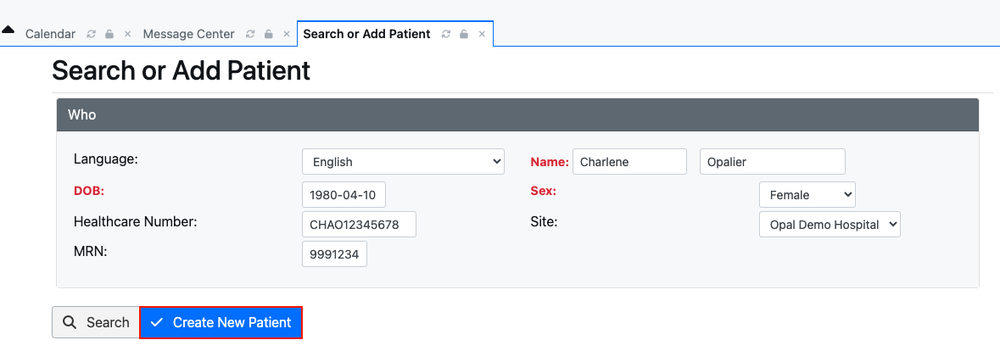

<!--
SPDX-FileCopyrightText: Copyright (C) 2025 Opal Health Informatics Group at the Research Institute of the McGill University Health Centre <john.kildea@mcgill.ca>

SPDX-License-Identifier: CC-BY-SA-4.0
-->

# OpenEMR: Adding a new patient

This document does not provide full OpenEMR instructions for creating and adding a patient. It is intended for clinics or health systems integrating with the Opal application, with the minimal OpenEMR requirements for this integration.

If you need more information about the OpenEMR system and its complete set of features, please refer to this link: [https://www.open-emr.org/](https://www.open-emr.org/)

The purpose of this document is to show the steps for adding a new patient to the OpenEMR system, that will be registered and use Opal. This document is intended for the Hospital front desk staff.

1. Access OpenEMR and log in.

1. A **Calendar** section will appear. A list of **Providers** will be located on the left of the screen. By clicking on a specific name of the list, you can see the provider's calendar and their scheduled appointments.

1. You can choose to view the provider's calendar by Day, Week or Month, by clicking on one of the appropriate blue buttons on the top right of the screen. You can also print your calendar (daily, weekly or monthly), by clicking on the blue "printer” icon located at the top right of the screen.

    
    Figure: Full calendar view:full_calendar

    
    Figure: Provider calendar view:provider_calendar

1. At the top left of the screen, click on the **Patient** section. A list will appear with two options: **Find Patient** and **Add Patient**. Click on the **Add Patient** tab.

    
    Figure: Add patient:add_patient

1. The **Search or Add Patient** section will be displayed. You will see a **Who** tab with fields to enter the new patient information. At this step, you must fill in all the fields, such as **Language**, **First** and **Last name**, **Date of Birth (DOB)**, **Sex**, **Healthcare Number**, **Site** and the **MRN** (medical record number).

1. Once the above required fields have been filled in, click on **Create New Patient**. A pop-up window will appear with the following message: _No matches were found_. To complete adding a new patient, click on **Confirm Create New Patient.**

    
    Figure: Create new patient:create_patient

    
    Figure: Confirm create new patient:confirm_create_patient

1. Once the new patient is added to the system, their **Medical Record Dashboard** will be displayed, showing the information entered previously. You can verify all the patient's personal information you just entered.

1. To set your patient up to use the Opal application, please refer to the Opal Admin Patient Module User Guide. Follow the instructions for Opal Registration and generating a QR code.
