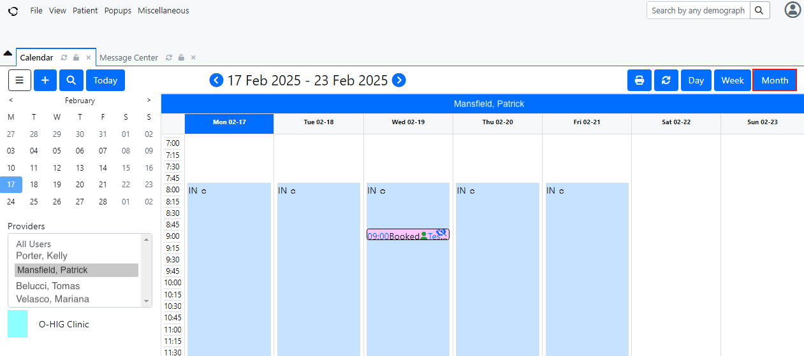
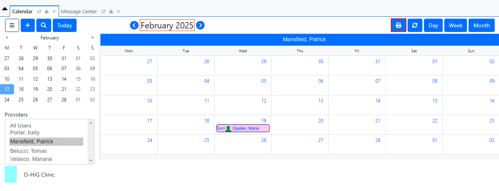
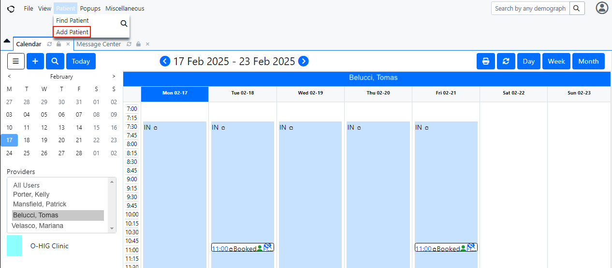
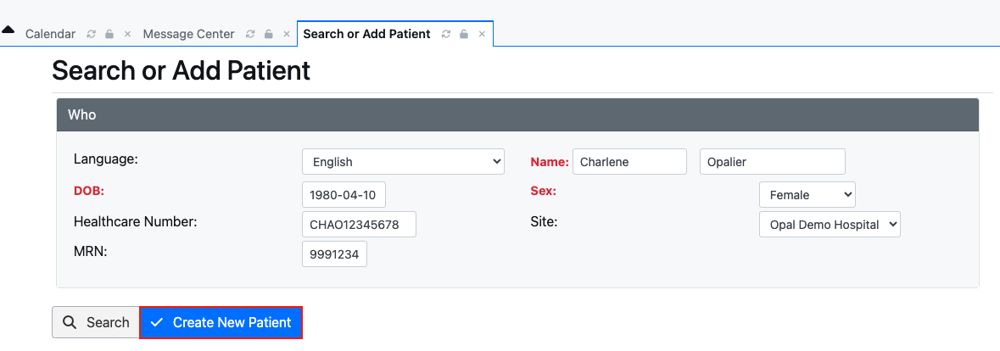
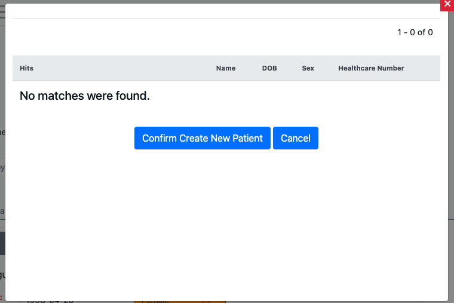
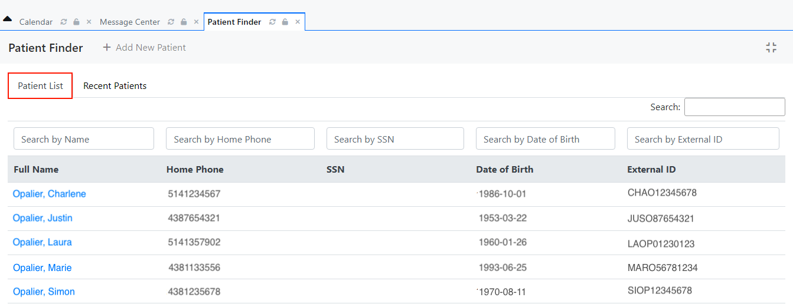
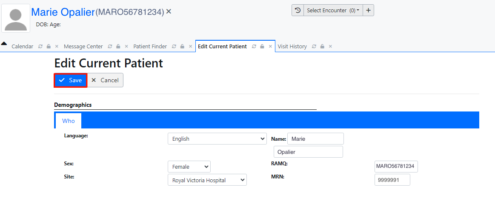
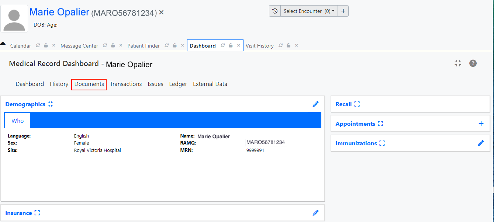
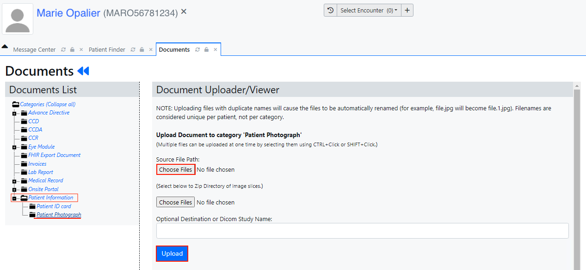

<!--
SPDX-FileCopyrightText: Copyright (C) 2025 Opal Health Informatics Group at the Research Institute of the McGill University Health Centre <john.kildea@mcgill.ca>

SPDX-License-Identifier: CC-BY-SA-4.0
-->

# OpenEMR: Adding and updating patients

The purpose of this document is to show the steps for adding and updating patients to OpenEMR, that can then be registered and use Opal. It does not provide full OpenEMR instructions for adding and updating a patient. It provides the minimal OpenEMR requirements for healthcare institutions who are integrating with the Opal solution.

If you need more information about OpenEMR and its complete set of features, please refer to this link: [https://www.open-emr.org/](https://www.open-emr.org/)

This document is intended for the hospital's administrative staff.

## Adding a new patient

1. Access OpenEMR and log in.

1. A **Calendar** section will appear. A list of **Providers** will be located on the left of the screen. By clicking on a specific name of the list, you can see the provider's calendar and their scheduled appointments.

1. You can choose to view the provider's calendar by Day, Week or Month, by clicking on one of the appropriate blue buttons on the top right of the screen. You can also print your calendar (daily, weekly or monthly), by clicking on the blue "printer” icon located at the top right of the screen.

    

    

1. At the top left of the screen, click on the **Patient** section. A list will appear with two options: **Find Patient** and **Add Patient**. Click on the **Add Patient** tab.

    

1. The **Search or Add Patient** section will be displayed. You will see a **Who** tab with fields to enter the new patient information. At this step, you must fill in all the fields, such as **Language**, **First** and **Last name**, **Date of Birth (DOB)**, **Sex**, **Healthcare Number**, **Site** and the **MRN** (medical record number).

1. Once the above required fields have been filled in, click on **Create New Patient**. A pop-up window will appear with the following message: _No matches were found_. To complete adding a new patient, click on **Confirm Create New Patient.**

    

    

1. Once the new patient is added to the system, their **Medical Record Dashboard** will be displayed, showing the information entered previously. You can verify all the patient's personal information you just entered.

1. To set your patient up to use the Opal application, please refer to the Opal Admin Patient Module User Guide. Follow the instructions for Opal Registration and generating a QR code.

## Searching for a patient

1. To search for a patient, click on the **Patient** section located at the top left of the screen. A list will appear with two options: **Find Patient** and **Add Patient**. Click on the **Find Patient** tab.

    

1. In the **Patient Finder** section, you will see a list of all the patients available in OpenEMR.

1. You can search for a patient by Name, by Phone, by Date of Birth or by ID.

    

## Updating a patient's information

1. Once you have performed your search, click on the name of the patient for whom you want to update some information.

    

1. The patient's **Medical Record Dashboard** has multiple sections. The **Demographics** section is where you will find all the patient's main information, such as Name, Language, Sex, etc.

1. To be able to update any of the patient's information in the **Medical Record Dashboard,** click on the **edit icon** (pencil), located on the right side of each section.

    

1. An **Edit Current Patient** page will be displayed. Once any of the patient's information has been updated, click on the **Save** button.

    

1. The patient's **Medical Record Dashboard** will be displayed with the updated information.

1. For example, to update the patient's photo in the patient's **Medical Record Dashboard,** click on the **Documents** tab.

    

1. A **Documents List** will be displayed on the left side. Scroll it down and click on the **Patient Information** folder. Then, click on the **Patient Photograph**.

1. A **Document Uploader/Viewer** page will be displayed. Select a photograph to be uploaded by selecting **Choose Files** under the **Source File Path** section. Once selected, click on the **Upload** button.

    You must refresh the patient's page in order to see the new photo.

    
