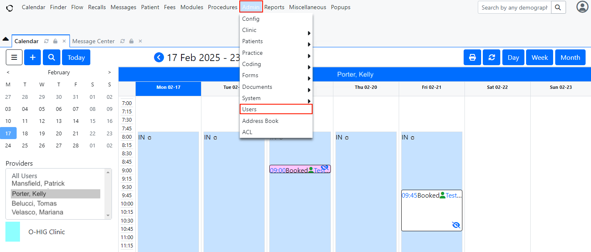
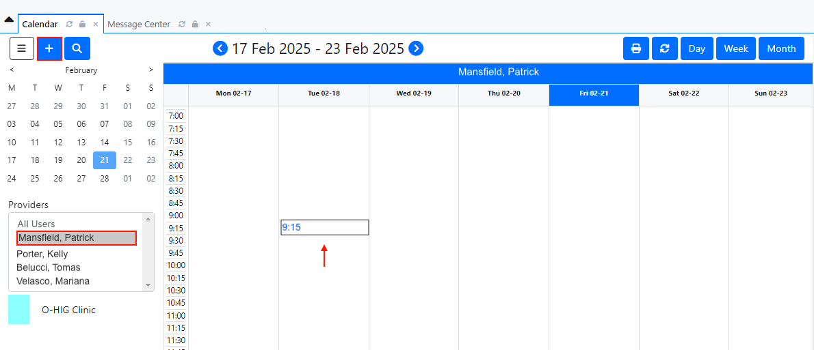
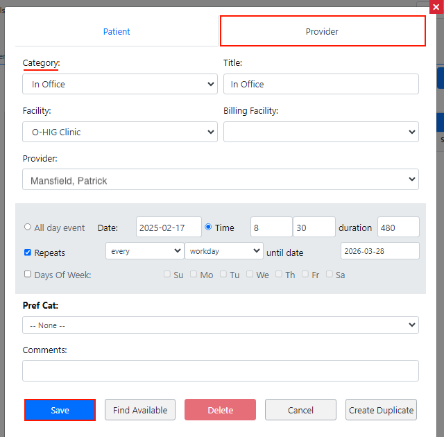
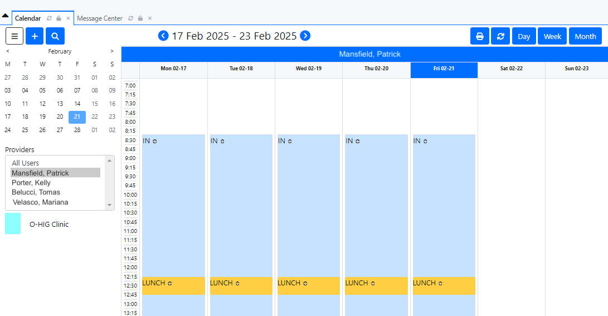

<!--
SPDX-FileCopyrightText: Copyright (C) 2026 Opal Health Informatics Group at the Research Institute of the McGill University Health Centre <john.kildea@mcgill.ca>

SPDX-License-Identifier: CC-BY-SA-4.0
-->

# OpenEMR: Adding a new provider

This document does not provide full OpenEMR instructions for creating and adding a provider. It is intended for clinics or health systems integrating with the Opal application, with the minimal OpenEMR requirements for this integration.

If you need more information about OpenEMR and its complete set of features, please refer to this link: [https://www.open-emr.org/](https://www.open-emr.org/).

The purpose of this document is to show the steps of adding a new provider and creating a provider's work calendar in OpenEMR, with the objective of scheduling appointments for a patient. This document is intended for the hospital's administrative staff.

1. Access OpenEMR and log in.

1. A **Calendar** section will appear. A list of **Providers** will be located on the left of the screen. By clicking on a specific name of the list, you can see the provider's calendar and their scheduled appointments.

1. At the top of the screen, click on the **Admin** section. A drop-down menu will be displayed. Click on the **Users** tab.

    

1. A **Users / Groups** section will be displayed and you can see a list of providers that already exist. Click on the **+ Add User** button.

    

1. An **Add User** page will be displayed. You must enter the appropriate provider information.
    Start by entering the **Username** and the **Password** that the provider will be using to log into OpenEMR.
    Choose a [strong password](https://1password.com/password-generator#:~:text=What%20makes%20passwords%20strong) for the user, for example, a unique password that has at least 20 characters and contains at least a digit, capital letter, and special character.

    In the **Your Password** field, please enter your own password.
    This is to confirm the action of adding a new user.

1. Next, you must click only on the **Provider** and **Calendar** checkboxes. Now, enter the provider's information on the required fields, such as **First Name** and **Last Name**, **Provider Type** and **Access Control** (always select Physician(s) on those last 2 fields. Make sure that Administrator is NOT selected).

    *Note: If you wish, you can write additional information about the provider, and you can also add the provider's license number on the Federal Tax ID field.*

    

1. Once the required fields above have been filled in, click on the **Save** button at the top of the screen. The **Calendar** section will be displayed. You can now see the name of the new provider in the **Providers** field.

    *Note: By clicking on the name of the new provider, you will see an empty calendar. It is mandatory to set up the provider's profile (i.e., their schedule).*

    

## Setting up the provider's calendar in OpenEMR

1. In the **Calendar** section, click on the name of the provider you want to set up the profile for. A blank calendar will be displayed.

1. Click on the **+** button at the top left of the screen, or click anywhere on the calendar.

    

1. A pop-up window will appear with two tabs: **Patient** and **Provider.** Click on the **Provider** tab.

1. Now, enter the provider's information in the **Category** field (you can indicate whether the provider is "in office", "on lunch", "on vacation", etc.) and the appropriate information in the gray box, such as start and date time, if it's a repeated date or specific days of the week and the duration (the duration must be entered in minutes).

    

1. When the required fields above have been filled in, click the **Save** button at the bottom of the screen. The **Provider Calendar** will appear highlighted in blue, starting and ending on the date you previously entered.

    
